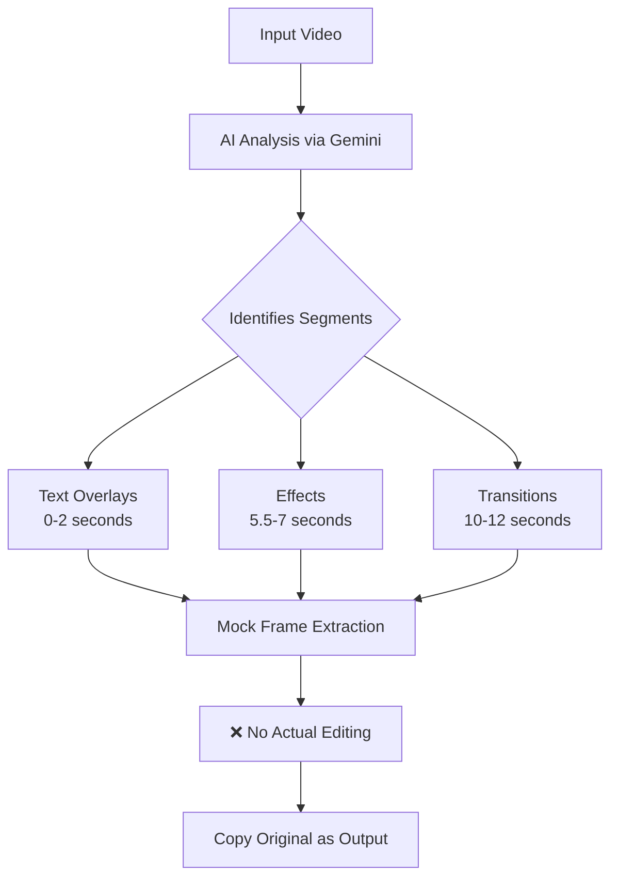

# Implementation Status

## Current State (as of 2025-08-28)

### ✅ Completed Components

1. **AI Integration (Gemini)**
   - Successfully connects to Gemini API
   - Analyzes videos and identifies enhancement opportunities
   - Returns structured JSON with:
     - Frame segments to edit
     - Enhancement types (text_overlay, effect_enhancement, scene_transition)
     - Specific suggestions for each segment

2. **Project Structure**
   - Main orchestrator class (`NanoBananaEditor`)
   - Configuration system
   - Logging infrastructure
   - Output directory organization

3. **Mock Components**
   - Mock VideoFrameExtractor (placeholder for actual frame extraction)
   - Test workflow validation

### ❌ Not Yet Implemented (Placeholders)

1. **Actual Frame Extraction**
   - Currently uses mock extractor that creates empty files
   - Needs: Real ffmpeg-based frame extraction at specified timestamps

2. **Video Editing Operations**
   - Text overlay rendering
   - Effect application
   - Scene transitions
   - Frame modifications

3. **Video Reconstruction**
   - Currently just copies original video
   - Needs: Reassemble edited frames into final video

## Current Workflow

## What Actually Happens vs What Should Happen

### Current Reality
1. Video uploaded ✅
2. Gemini analyzes and identifies edit points ✅
3. Creates directory structure for frames ✅
4. **Copies original video unchanged to output** ⚠️

### Intended Functionality
1. Video uploaded ✅
2. Gemini analyzes and identifies edit points ✅
3. Extract actual frames at timestamps
4. Apply edits to frames:
   - Add text overlays
   - Apply visual effects
   - Create transitions
5. Reconstruct video from edited frames
6. Output enhanced video

## Code Locations

- **Main Pipeline**: `main.py:217-279` (process_video method)
- **AI Analysis**: `main.py:74-127` (analyze_video_with_ai method)
- **Frame Extraction**: `main.py:129-215` (extract_targeted_frames method)
- **Mock Extractor**: `src/video/extractor.py` (placeholder implementation)

## Next Steps for Implementation

1. Replace mock VideoFrameExtractor with real implementation
2. Add OpenCV-based frame editing capabilities
3. Implement text overlay rendering
4. Add effect processing
5. Implement frame-to-video reconstruction